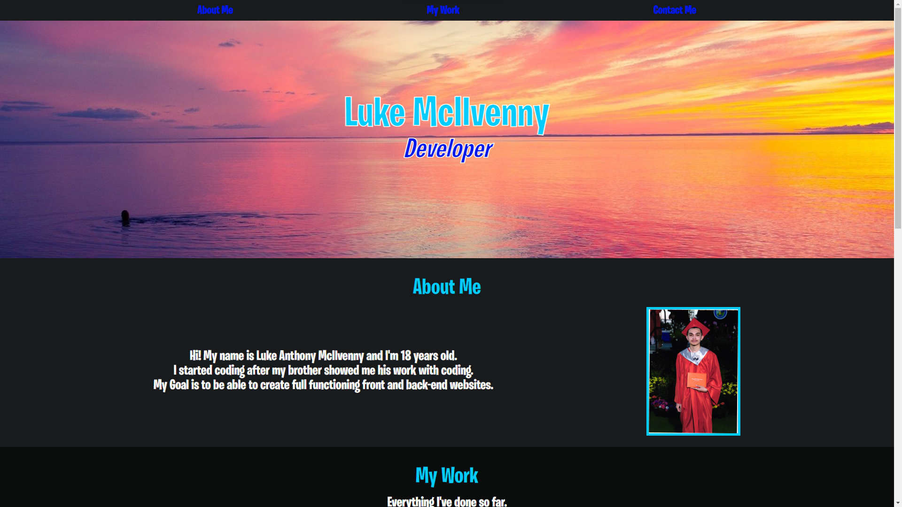

# Luke's Portfolio

- This is my portfolio which contains information about me and projects I've done.

- I added three buttons on the navbar that take you to the My Work section, About Me section, and the Contact Me seciton.

- I created and added image for the background of the hero and added my name and title to the hero.

- I made an About Me section which displays an image of myself and a short bio.

- I made a My Work section which displays the work I've done so far including an image for each work which if clicked, sends you to the deployed site, and th repository links.

-

# Deploy link

- https://tdglu.github.io/LukeMc-Portfolio/

# Screenshot

